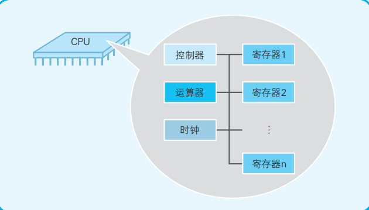
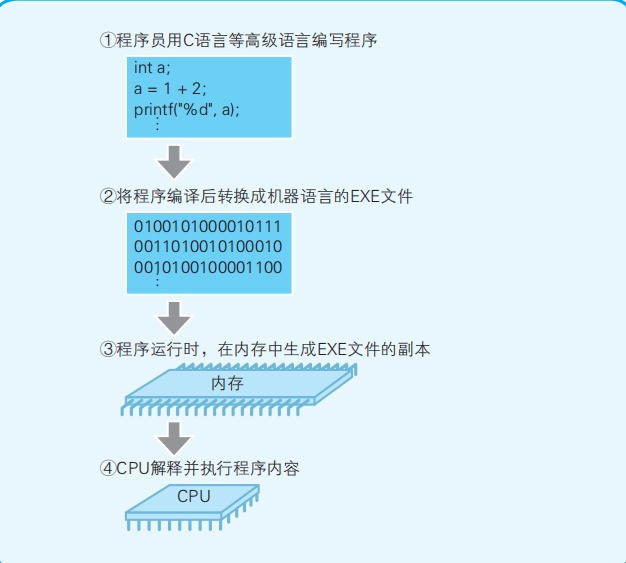

### 一、CPU

- 预备知识
  - **程序**：指示计算机每一步动作的一组指令
  - **程序的组成**：指令和数据
  - **机器语言**： CPU可以直接识别并使用的语言
  - **内存**：正在运行的程序的存储位置
  - **内存地址**：内存中，用来表示命令和数据存储位置的数值 
  - **CPU的功能**：解析和运行最终转换成机器语言的程序内容

#### 1.1 CPU的内存结构解析

- CPU的组成： **寄存器**、**控制器**、**运算器**和**时钟**（各部分之间用电流信号相互连通）

  

  

- CPU和内存是由许多晶体管组成的电子部件，通常称为**IC** (Integrated Circuit, **集成电路**)，俗称**芯片**（CPU是集成电路的一种）。

  - **寄存器(register)**：暂存指令、数据等处理对象，可视作内存的一种。一个CPU内部会有20-100个寄存器。

  - **控制器(controller)**：负责把内存上的指令、数据等读入寄存器，并根据指令的执行结果来控制整个计算机。

  - **运算器(operator)**：负责运算从内存读入寄存器的数据。

  - **时钟 (clock)**： 负责发出CPU开始计时的时钟信号(clock puzzle)。

- **内存(memory)**：计算机的主存储器(main memory)， 简称**主存**。特点：

  - 由可读写元素构成，每个字节(8位)都有一个地址编号。CPU可通过地址对内存进行读取指令和数据。
  - 通过控制芯片等与CPU相连，主要负责存储指令和数据。
  - 主存中的指令和数据会随着计算机的关机而自动清除。

- 程序的运行流程：

  ​		程序启动后，根据时钟信号，控制器会从内存中读取指令和数据，通过对这些指令的解释和运行，运算器就会对数据进行运算，控制器根据该运算结果来控制计算机。

  

#### 1.2 CPU是寄存器的集合体

- 程序是把**寄存器**作为对象来描述的

- 低级编程语言：汇编语言和机器语言

- **汇编(assembly)**：汇编语言 -> 机器语言

- 汇编器(assembler)：具有汇编功能的程序。

- **反汇编**：机器语言->汇编语言

- **编译(compile)**：高级语言->机器语言

- 编译器: 具有便于功能的程序

- 机器语言级别的程序是通过寄存器来处理的。

- 寄存器的主要种类和功能：

  | 种类                                 | 功能                                                         |
  | :----------------------------------- | ------------------------------------------------------------ |
  | 累加寄存器(accumulator register)     | 存储执行运算的数据和运算后的数据                             |
  | 标志寄存器(flag register)            | 存储运算处理后的CPU的状态                                    |
  | 程序计数器(program counter)          | 存储下一条指令所在内存的地址，决定着程序的流程               |
  | 基址寄存器(base register)            | 存储数据内存的起始地址                                       |
  | 变址寄存器(index register)           | 存储基址寄存器的相对地址                                     |
  | 通用寄存器(general purpose register) | 存储任意数据                                                 |
  | 指令寄存器(instruction register)     | 存储指令。CPU内部使用，程序员无法通过程序对该寄存器进行读写操作 |
  | 栈寄存器(stack register)             | 存储栈区域的起始地址                                         |

- 程序员眼里的CPU 寄存器：

- 

- **溢出(overflow)**：指的是运算的结果超出了寄存器的长度范围。

  

#### 1.3 决定程序流程的程序计数器

- 内存中配置的程序示例：

#### 1.4 条件分支和循环机制

- 顺序执行：按照地址内容的顺序执行命令，每执行一条指令程序计数器就自动加一

- 条件分支：根据条件执行任意地址的指令， 使用的是跳转指令

- 循环：重复执行同一地址的指令，使用的是跳转指令

- 执行条件分支的程序示例：

  

#### 1.5 函数的调用机制

- **函数调用**：使用的是call指令，而不是跳转指令。在将函数的入口地址设定到程序计数器之前，call指令会把调用函数后要执行的指令地址存储在名为栈的主存内。函数处理完毕后，再通过函数的出口来执行return命令。**return命令的功能是把保存到栈中的地址设定到程序计数器中。**

- 程序函数调用示例：

- 

  

- 程序计数器和栈的功能：

- 

#### 1.6 通过地址和索引实现数组

- 为了方便理解，计算机通常使用十六进制数代替二进制数。A~F分别表示10~15，这样32位的二进制数就可以使用8位的十六进制数来表示。

- 在查看地址时，CPU会把初始地址存入基址寄存器，把基址寄存器+变址寄存器的值解释为实际查看的内存地址。变址寄存器相当于高级编程语言程序中数组的索引功能。

  

#### 1.7 CPU的处理

- 机器语言指令的主要类型和功能：

| 类型             | 功能                                                         |
| ---------------- | ------------------------------------------------------------ |
| 数据转送指令     | 寄存器和内存、内存和内存、寄存器和外围设备之间的数据读写操作 |
| 运算指令         | 用累加寄存器执行算术运算、逻辑运算、比较运算和移位运算       |
| 跳转指令         | 实现条件分支、循环、强制跳转等                               |
| call\return 指令 | 函数的调用\返回调用前的地址                                  |

***

### 二、 数据

#### 2.1 用二进制表示计算机信息的原因

- CPU和内存都是IC的一种，IC的所有引脚只有直流电压0V或5V两种状态。IC的这个特性决定了计算机的信息数据只能用二进制来处理。
- **bit** 是二进制数位**binary digit**的缩写
- 8个二进制位数被称为一个**字节**。
- 使用字节单位处理数据时，如果数字小于存储的字节数，那么高位上就用0填补。

#### 2.1 什么是二进制数

#### 2.3 移位运算和乘除运算的关系

- **移位运算**指的是将二进制数值的各数位进行左右位移的运算。

- 左移高位补0，右移补1或补0。

- 移位运算中溢出的数位直接**丢弃**。

- 左移相当于**乘以**2的n次幂，右移相当于**除以2**的n次幂(n是移动的位数)。

  

#### 2.4 便于计算机处理的"补数"

- 二进制中表示负数值时，一般会把最高位作为符号来使用。**符号位是0时表示正数 符号位为1时表示负数。**
- **计算机中只有加法运算**，在表示负数时使用补数来表示，即用正数表示负数。

- **取反**：0变1,1变0。
- 补数的操作：各数位**取反**，然后在取反的结果加一。

- 同样的位数下，计算机能表示的负数比正数多一个，因为在4位的情况下，1000和0000都是表示0，为了不浪费，规定1000表示-8，0在计算机内部被划分为正数。

  ***即为了计算减法——发明补数——补数的缺陷：0 的表示——用负数那个0表示最小的负数***

#### 2.5 逻辑右移和算术右移的区别

- **逻辑移位**： 不考虑符号的移位，无论是左移还是右移，都在空出来位置补0。
- **算术移位**：考虑符号的移位，左移时在空出来的位置补0，右移时正数补0，负数补1。

- **符号扩充**：保持值不变的前提下将其向高位二进制数转换，正数补0，负数补1.

#### 2.6 逻辑运算

- **算术运算**：加减乘除四则运算。
- **逻辑运算**：对二进制位的各数字位的0和1分别进行处理的运算。
  - 逻辑非(**NOT**)：取反操作，0变1，1变0
  - 逻辑与(**AND**)：两个数值都是1时，结果才为1
  - 逻辑或(**OR**)：两个数值至少有一个1时，结果才为1
  - 逻辑异或(**XOR/EOR**, exclusive or)：两个数值不同时，结果才为1

- 图形模式的逻辑运算：

---

### 三、 小数运算

- 计算机也存在计算错误的情况，小数运算就是例子。

  

#### 3.1 将0.1累加100次也得不到10

#### 3.2 用二进制数表示小数

- 二进制表示小数的处理跟整数是一样的，将各个数位的数值跟问权相乘的结果相加就好。

- 二进制小数的**位权**：第一位是2的-1次幂，第二位是2的-2次幂···

#### 3.3 计算机运算出错的原因

- **原因**： 小数的位权无法组成所有小数数值

#### 3.4 什么是浮点数

- **浮点数**：用符号、尾数、基数和指数这四部分来表示的小数。

- **双精度浮点数**：用64位表示的小数，其中符号1位，指数11位，尾数52位
- **单精度浮点数**：用32位表示的小数其中符号1位，指数8位，尾数23位
- 表现形式：

#### 3.7 如何避免计算机计算出错

1. 回避，无视这些错误。
2. 把小数转换成整数来计算。

#### 3.8 二进制数和十进制数

- 以位为单位表示数据时，使用二进制数很方便，如果位数太多看起来就比较麻烦。
- 十六进制数格式：数字开头加上0x

---

### 四、内存

- 预备知识：
  - 计算机是进行数据处理的设备，程序表示的是处理顺序和数据结构

#### 4.1 内存的物理机制

- 内存实际上是一种名为**内存IC**的电子元件

- 内存IC中有**电源**、**地址信号**、**数据信号**、**控制信号**等用于输入输出的大量引脚，**通过为其指定地址来进行数据读写**。**数据和地址的本质都是电信号**。

- 内存的形式:

  - DRAM(Dynamic Random Access Memory)：需要刷新才能保存数据
  - SRAM(Static Random Access Memory)：不需要刷新电路即能保存数据
  - ROM(Read Only Memory)：只能用来读取的内存  

- RAM内存IC示例:

   

  - 这个内存IC中数据引脚有**八个**表示**一次可以输入输出8位的数据**

  - 地址信号引脚有**十个**，可以指定1024个地址，即**可以存储1KB的数据**

  - 计算机领域中，**K表示的是2^10, 而1000通常用k来表示**

  - 如何写入1字节的数据：

    ​       首先给VCC接入+5V，给GND接入0V电源，并使用A0~A9的地址信号来指定数据的存储场所，然后再把数据的值输入给D0~D7的数据信号，并把WR信号设定为1

    

#### 4.2 内存的逻辑模型

- 内存模型：

  

- 编程语言中的**数据类型**表示存储的是何种类型的数据，从内存来看，就是**占有的内存大小**的意思。

- 内存存储字节节序：

  - 低节节序：将多字节的数据的低位字节存储在内存低位地址的方式

  - 高节节序：将多字节的数据的高位字节存储在内存低位地址的方式

    

#### 4.3 指针

- **指针也是一种变量，它所表示的不是数据的值，而是存储着数据的内存的地址**。通过指针，可以对任意指定地址的数据进行读写。

#### 4.4 数组，高效使用内存的基础

- **数组是指多个同样类型的数据在内存中连续排列的形式。**数组元素的各个数据会通过**连续的编号**被区分开来，这个编号称为**索引**。

- **存取结构：**

  - **随机存取**：又叫直接存取，即可以通过下标直接访问的数据结构，与存储位置无关，存取第N个数据时，不需要访问前面N-1个数据即可对第N个数据进行操作。数组就是一种采用随机存取方式的数据结构。

  - **顺序存取**：跟随机存取相对，就是在存取第N个数据时，必须先访问前面的N-1个数据

- **存储结构：**

  - **顺序存储结构**：把逻辑上相邻的节点存储在物理位置上相邻的存储单元中，节点之间的逻辑关系有存储单元的邻接关系来体现，缺点是不便于修改。数组就是使用的顺序存储结构。 
  - **随机存储结构**：不要求逻辑相邻的元素在物理位置上也相邻，可用一组任意的存储单元存储数据元素，插入删除较为灵活，但也失去了随机存取的特点。

#### 4.5 栈、队列以及环形缓冲区

- 栈和队列都可以**不通过指定地址和索引来对数组的元素进行读写**，只需要预留出空间即可
- 两者区别：栈用的是**LIFO**(Last Input First Out)方式，而队列用的是**FIFO**(First Input First Out)方式

- 队列一般是以环状缓冲区(ring buffer) 的方式实现的。
- 环状缓冲区模型：

#### 4.6 链表使元素的追加和删除更容易

- 链表和二叉搜索树都是**不用考虑索引的顺序**就可以对数组元素进行读写的方式。

#### 4.7 二叉搜索树使数据搜索更有效

- 二叉搜索树是指**在链表的基础上往数组中追加元素时，考虑数据的大小关系，将其分成左右两个方向的表现形式**

  

---

### 五、磁盘

#### 5.1 不读入磁盘就无法运行

- 磁盘中的程序，不加载到内存就无法运行。因为CPU负责解析和运行程序内容，需要通过内部程序计数器来指定内存地址，才能读出程序。

  

#### 5.2 磁盘缓存加快了磁盘访问速度

- **缓存(cache)**：把低速设备的数据保存在高速设备中，需要时可以直接将其从高速设备中读出。

- **磁盘缓存(disk cache)**： 把从磁盘读出的数据存储到内存空间的方式。

  

 

#### 5.3 虚拟内存把磁盘作为部分内存来使用

- **虚拟内存(virtual memory)**：把磁盘的一部分作为假想内存来使用。

- **磁盘缓存是假想的磁盘(实际上是内存)，虚拟内存是假想的内存(实际上是磁盘)。**

- 在使用虚拟内存时，正在运行的程序这个时间点必须在内存中，而未运行的和已运行的程序可以保存在磁盘中。
- 虚拟内存有**分页式**和**分段式**两种。
- 分页式：
  - 在不考虑程序构造的情况下，把运行的程序按照一定大小的页(page)进行分割，并以页为单位在内存和磁盘间进行置换。
  - 把磁盘的内容读出到内存称为Page In，把内存的内容写入磁盘称为Page Out。
  - Window计算机的页的大小是**4KB**，windows在磁盘上提供了虚拟内存用的文件(**page file**)。
  - Windows的虚拟内存大小查看方法：命令行输入"systeminfo"命令
  - 

#### 5.4 节约内存的编程方法

- **通过DLL文件实现函数共有。** 

  函数的加载方式有**静态链接**和**动态链接**两种。DLL(Dynamic Link Library)文件在程序运行时可以动态加载Library的文件。多个应用可以通过共有同一个DLL文件，达到节约内存的效果。

- **通过调用_stdcall来减小程序文件的大小。**

  在程序运行时，如果发生了函数调用，那么栈的清理处理会附加在函数的调用方，在同一个程序中，同样的函数的清理操作是一样的。如果一个函数被反复调用，就会导致同一处理被反复进行。在函数前加入_stdcall，就可以把栈的清理操作变为被调用一方执行，达到节省内存的效果。

#### 5.5 磁盘的物理结构

- 磁盘的物理结构是指**磁盘存储数据的形式**

- 磁盘是通过把其物理表面划分成多个空间来使用的，划分的方式有**可变长方式**和**扇区方式**两种。 

  - **可变长方式**：把磁盘划分为长度可变的空间  

  - **扇区方式**：
    - 将磁盘划分为固定长度的空间。
    - 把磁盘表面分成若干个同心圆的空间就是**磁道**
    - 把磁道按照固定大小(能存储的数据长度相同)划分而成的空间就是**扇区**。
    - 
    - **扇区是磁盘保存数据的物理单位。**Windows使用的磁盘，一般一个扇区是512字节
    - **簇是磁盘保存数据的逻辑单位。**Windows在逻辑方面对磁盘进行读写的单位是**扇区的整数倍簇**。1簇=1扇区/2扇区/3扇区···
    - 在软盘中，1簇=1扇区
    - **不同的文件不会存储在同一个簇中**

  

  

  ---

   

### 六、压缩数据

#### 6.1 文件以字节为单位保存

- 文件是字节数据的集合。

  

#### 6.2 RLE算法机制

- RLE算法：把文件内容用“**数据 x 重复次数**” 的形式来表示的压缩方法称为**RLE(Run Length Encoding)**

  

#### 6.3 RLE算法的缺点

- 不适合对文本文件的压缩(**文本文件离散数据较多**)。

- **压缩比**：压缩后同压缩前文件大小的比率

  

#### 6.4 哈夫曼编码

- 哈夫曼编码：多次出现的数据用小于8位的字节数表示，不常用的数据使用超过8位的字节数来表示。（但最终还是以字节为单位保存在文件中）

#### 6.5 用二叉树实现哈夫曼编码

- 哈夫曼树：

  

#### 6.7 可逆压缩和非可逆压缩

- **BMP文件**：Windows的标准图像数据文件，完全未压缩。(bitmap)

- **JPEG文件**：（Joint Photographic Experts Group）是数码相机等常用的一种图像数据形式

- **TIFF**：（Tag Image File Format）是一种通过在文件头中包含“标签”就能够显示出数据性质的图像数据形式。

- **GIF**：（Graphics Interchange Format）是由美国 CompuServe 开发的一种数据

  格式。这种格式要求色数不超过 256 色

- **可逆压缩**：能还原到压缩前状态的压缩

- **非可逆压缩**：无法还原到压缩前状态的压缩

---

### 七、程序的运行环境

#### 7.1 运行环境 = 操作系统 + 硬件

- 不同CPU的机器语言不同
- **本地代码**： 机器语言的程序
- **源代码**：在无文字编码问题时，在任何环境下都能显示和编辑的代码
- **源代码 —(编译)—>本地代码**
- 

#### 7.2 Windows 克服了CPU以外的硬件差异

#### 7.3 不同系统的API不同

- 应用向操作系统传递指令的途径称为**API(Application Proframming Interface)**
- 同类型操作系统的API基本上没有差别
- 不同系统的计算机因为API不同，CPU的类型不同，生成的本地代码不一样。
- 同一系统的计算机即使是同一系统，因为CPU的类型不一样，生成的本地代码也不一样。

#### 7.4 FreeBSD Port

- CPU不同会导致同样的本地代码无法重复利用，FreeBSD具有**通过使用源代码来提供应用，并根据运行环境进行整合编译，从而得以在该环境下运行的机制的机制**，也叫“**移植**”。

- Unix系列操作系统FreeBSD中，存在一种名为Ports的机制。该机制能够结合当前运行的硬件环境来编译应用的源代码，进而得到可以运行的本地代码系统，如果目标应用的源代码不在硬件上的话，Posts就会自动使用FTP连接到相关站点来下载代码。

  

- **FTP(File Transfer Protocol)**是连接到互联网上计算机之间传送文件的协议

#### 7.5 虚拟机

- 利用虚拟机软件，就可以在一种系统里面运行另一种系统的软件。

#### 7.6 提供相同运行环境的Java虚拟机

- Java有两个层面的意思**一个是作为编程语言的Java，另一个是作为程序运行环境的Java。**

- Java编译后生成的不是特定CPU使用的本地代码，而是名为**字节代码**的程序

- 字节代码的运行环境就称为**Java虚拟机**， Java虚拟机就是一边把Java字节代码逐一转换成本地代码一边运行的

  

#### 7.7 BIOS 和 引导

- **BIOS**：Basic Input / Output System，是预先内置在计算机内部的系统，存储在ROM中。具有键盘、磁盘、显卡等基本控制和启动"引导程序"。
- **引导程序**是存储在启动驱动器起始区域的小程序，作用是把在硬盘等记录的OS加载到内存中运行。
- 开机后，BIOS会确认硬件是否正常运行，没问题的话就启动引导程序。

- Bootstrap)

---

### 八、源文件，可执行文件

#### 8.1 计算机只能运行本地代码

- 由某种编程语言编写的程序就称为**源代码**，保存源代码的文件称为**源文件**

- CPU运行程序： 

  

#### 8.2 本地代码的内容

- **Dump**： 指的是把文件的内容，每个字节用2位十六进制数来表示的方式

#### 8.3 编译器负责转换源代码 

- 编译器也是程序的一种，也需要运行环境
- 编译器三个相关因素：编程语言、CPU种类、操作系统类型

#### 8.4 可执行文件

- 编译转换源代码后，就会生成本地文件，还有转换成exe文件才能运行。
- 源代码-(**编译**)->目标文件(.obj)-(**链接**)->EXE文件
- 链接器：运行链接的程序
- 选项：对编译器的指示，也称为开关
- 程序的启动：一个记述着同所有程序起始位置相结合的处理内容
- 函数的加载方式有**静态链接**和**动态链接**两种。静态链接使用静态链接库，动态链接使用导入库和动态链接库

#### 8.5 启动及库文件

- “-Tpe-c-x-aa”: 指定生成Windows用的EXE文件的选项

- 外部符号：其他目标文件中的变量或函数

- **库文件**(.lib)指的是**把多个目标文件集成保存到一个文件中的形式**。

  - 库文件分两种：一种是静态库，另一种是动态库即DLL(Dynamic Link Library)文件，又叫动态链接库文件。
  - 静态库和动态库的区别是：静态库在程序的链接阶段被复制到了程序中；动态库在链接阶段没有被复制到程序中，而是程序在运行时由系统动态加载到内存中供程序调用。

- 库文件可以简化为链接器的参数指定多个目标文件的过程

- **标准函数**：不是通过源代码形式而是通过库文件形式和编译器一起提供的函数

- 通过以目标文件的形式或多个集合目标文件的库文件形式来提供函数，就可以不用公开标准函数的源代码

  

#### 8.6 DDL文件及导入库

- API：操作系统为应用提供的功能的函数，目标文件存储在名为DLL文件的特殊库文件中
- 导入库：只包含了地址符号表等，确保程序找到对应函数的一些基本地址信息（实际的执行代码位于动态库中）。即**提供动态链接库的信息**。
- 静态链接库：存储着目标文件的实体，并直接和EXE结合的库文件的形式
- 

#### 8.7 可执行文件运行时的必要条件

- EXE文件的内容：**再配置信息，变量组和函数组**，函数不是狭义的函数，指的是处理。

- EXE的运行机制：作为单独的文件存储在硬盘中，通过把EXE文件的内容加载到内存中运行。EXE文件中给变量及函数分配了虚拟的内存地址，在运行时，虚拟的地址会转换成实际的内存地址，而转换的必要信息在EXE文件的开头

- 再配置信息：链接器在 EXE 文件的开头，追加的转换内存地址所需的必要信息，即变量和函数的相对地址

  

#### 8.8 栈和堆

- 程序(不是操作系统)加载到内存后，分为四部分空间：**用于变量的内存空间，用于函数的内存空间，用于栈的内存空间，用于堆的内存空间**（？变量存在栈中？？）

- **栈**：存储函数内部临时使用的变量(局部变量)

- **堆**：存储程序运行时的任意数据及对象的内存领域

- 栈和堆的异同：

  - 相似之处：两者的内存空间都是在程序运行时得到申请分配的
  - 不同之处：栈的空间的生成和释放是由编译器自动操作的，堆中的内存空间需要程序员明确分配和释放。

- **内存泄漏**：堆中的空间在程序处理完毕后没有明确释放，该内存空间仍会一直残留

- 

  

#### 8.9 零散知识点

- **编译器和解释器**：编译器是在运行前对所在源代码进行解释处理，解释器则是在运行时对源代码的内容进行一行一行地进行解释处理

- **分割编译**：将整个程序分为多个源代码来编写，然后分别进行编译，最后链接成一个EXE文件，使得每个源代码都相对变短嗯，便于程序管理
- **Build**：连续执行编译和链接
- 使用DLL文件的好处：里面的函数可被多个程序共用，节约内存和磁盘，对函数的内容进行修正时，不需要重新链接使用这个函数的程序
- 不链接导入库调用DLL文件中的函数：使用LoadLibrary() 及GetProcAddress()这些API。不过使用导入库更简单

- 叠加链接：将不会同时执行的函数，交替加载到同一个地址中运行。
- 垃圾回收机制：garbage collection，对处理完毕不需要的堆内存的空间的数据和对象进行清理，释放它们所在的内存空间（Java和C#等可以自动回收）

---

### 九、操作系统与应用

- **操作系统**：操作系统（Operating System）也称为基础软件。操作系统是计算机运行时

  不可或缺的控制程序，以及在控制程序下运转的为其他软件运行提供操作

  环境的软件的统称。另外，在操作系统上运行的应用也称为“应用程序”

  

#### 9.2 操作系统

- 应用程序通过操作系统来间接控制硬件

  

#### 9.3 系统调用和高级编程语言的移植性

- 操作系统通过一些小的函数集合体的形式来控制硬件，这些函数及调用函数的行为称为**系统调用（system call）**

#### 9.4 文件是操作系统对磁盘媒介空间的抽象化

#### 9.5 Windows操作系统的特征

1. 32 位操作系统（也有 64 位版本） 
2. 通过 API 函数集来提供系统调用
3. 提供采用了图形用户界面的用户界面
4. 通过 WYSIWYGA 实现打印输出
5. 提供多任务功能： 多任务指的是同时运行多个程序的功能。Windows 是通过时钟分割技术来实现多任务功能的。
6. 提供网络功能及数据库功能
   - 中间件：处于操作系统和应用的中间的软件
   - 系统软件：操作系统和中间件
7. 通过**即插即用**(Plug-and-Play)实现设备驱动的自动设定

---

### 十、从汇编语言了解程序

- 助记符：代表本地代码的指令的功能的英文缩写

- .asm: 汇编语言源文件的后缀名

  

#### 10.1 汇编语言和本地代码一一对应

- 汇编语言：使用助记符的编程语言

- 汇编：汇编语言-(汇编器)->本地代码

  

#### 10.3 伪指令

- 汇编语言的源代码 = 操作码 + 伪指令
- 伪指令：负责把程序的构造及汇编的方法指示给汇编器

#### 10.4 汇编语言的语法：操作码 + 操作数

---

### 十一、硬件控制

---

### 十二、让计算机思考

#### 12.4 程序生成随机数的原理

- 伪随机数： 借助公式生成的随机数
- 线性同余法：如果把 *Ri* 作为当前随机数的话，那么下一个出现的随机数 *R**i* + 1 就可以用*R**i* + 1 = (*a*× *Ri* + *b*) mod *c*来获取，*Ri*、*a*、*b*、*c* 的数值就称为**随机数的种子**

---

